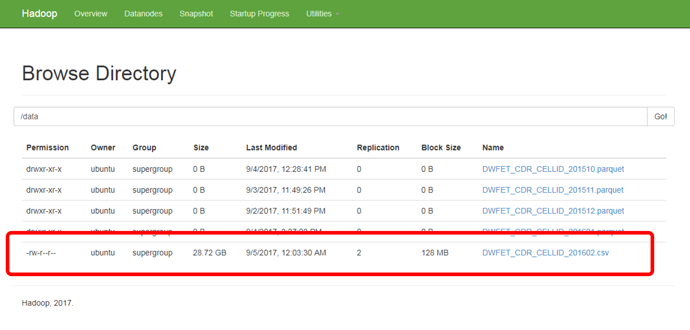
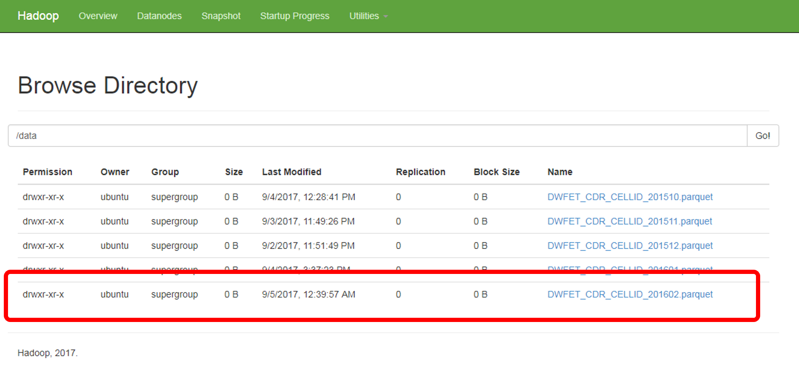

# Data load on the HDFS cluster
## Data size
The dataset to analyze is made of six files recording each one month's call detail records. Once uncompressed (one of them is corrupted and only part of the file has been recovered), their size is:

```bash
-rw-rw-r--  1 ubuntu ubuntu 42473368189 Mar  5  2016 DWFET_CDR_CELLID_201510.csv
-rw-rw-r--  1 ubuntu ubuntu 42319207977 Mar  5  2016 DWFET_CDR_CELLID_201511.csv
-rw-rw-r--  1 ubuntu ubuntu 52670621324 Mar  5  2016 DWFET_CDR_CELLID_201512.csv
-rw-rw-r--  1 ubuntu ubuntu 52279262820 Mar  5  2016 DWFET_CDR_CELLID_201601.csv
-rw-rw-r--  1 ubuntu ubuntu 30836942213 Mar  5  2016 DWFET_CDR_CELLID_201602.csv
-rw-rw-r--  1 ubuntu ubuntu   Mar  5  2016 DWFET_CDR_CELLID_201603.csv
```

## Dataset upload to HDFS
An essential prerequisite for carrying out data analysis tasks is to make the dataset available to the processing engine (i.e., to the Spark cluster). To efficiently store data, the Parquet format will be used. [Apache Parquet](https://parquet.apache.org/) is a columnar storage format available to any project in the Hadoop ecosystem. Thus, it is compatible with Apache Spark and can be read and written by any Spark-based task. It provides efficient data compression and encoding schemes with enhanced performance to handle complex data in bulk. It supports several codecs for compressing data; in this project, the default option, gzip, will be used.

Once the HDFS cluster is running, data can be uploaded to it by using the [HDFS File System (FS) shell](https://hadoop.apache.org/docs/r2.7.4/hadoop-project-dist/hadoop-common/FileSystemShell.html). First, a folder for the dataset is created in the HDFS namespace (`/data`). In an analogous way, a new folder will be created to store summaries of the results (Pandas dataframes stored as CSV files). The main idea is to have them available for creating new visualizations without making Spark recompute the results. 
```bash
hdfs dfs -mkdir /data
hdfs dfs -mkdir /dataframes
```
Each file in the dataset is uploaded to the cluster master instance and uncompressed (one of the files happens to be corrupted; [gzrecover](http://www.urbanophile.com/arenn/hacking/gzrt/gzrt.html) has been used to extract the uncorrupted part of the file). Other instances could have been used as well.

Next, each file is uploaded to the master node and next put in the HDFS cluster. For instance, once a file (`DWFET_CDR_CELLID_201512.csv`) has been uploaded to the master node, it is stored in HDFS:
```bash
hdfs dfs -put DWFET_CDR_CELLID_201612.csv /data
```

In order to verify that the files have been loaded, the HDFS Web Interface (`http://<master-floating-ip-address>:50070/` > Utilities > Browse the file system) can be accessed:



The same procedure will be executed for every file the dataset is made of.

Once copied to the HDFS cluster, the CSV files are removed from the local filesystem.

## Data upload to HDFS as parquet files
A Python Spark notebook will be used to retrieve the plain CSV files from the HDFS cluster, read them as data frames within a Spark Session, appropriately apply a data type to each column, and save the data frame content as a Parquet file. The default format (`StringType`) is left for most of the columns (almost all numeric columns are handled as strings, as no numeric operations will be involved). `IntegerType` is assigned as the type of the column containing the duration of the Call Detail Record. The data type of two columns carrying dates (the start and end of Call Detail Records) is turned into `TimestampType`. Useless columns are removed. See code snippet below:

```python
from pyspark.sql.types import StructType, StructField, IntegerType, StringType, TimestampType

customSchema = StructType([StructField("DS_CDMSISDN", StringType(), True),
                            StructField("DS_CDIMSI", StringType(), True),
                            StructField("DS_IMEI", StringType(), True),
                            StructField("DT_CDDATASTART", TimestampType(), True),
                            StructField("DT_CDDATAEND", TimestampType(), True),
                            StructField("6NUM_LENGTH", StringType(), True),
                            StructField("ID_CELL_START", StringType(), True),
                            StructField("ID_CELL_END", StringType(), True),
                            StructField("DS_CALLIDENTIFICATIONNUMBER", StringType(), True),
                            StructField("ID_RECORDSEQUENCENUMBER", StringType(), True),
                            StructField("ID_CDTIPUSCOM", StringType(), True),
                            StructField("DS_CDCENTRAL", StringType(), True),
                            StructField("ACTUALIZACION_DATE", StringType(), True),
                            StructField("ID_CLIENTSOURCE", StringType(), True),
                            StructField("ID_CDOPERATORSOURCE", StringType(), True),
                            StructField("ID_CDCOUNTRYSOURCE", StringType(), True),
                            StructField("DS_CDNUMDEST", StringType(), True),
                            StructField("ID_CDOPERATORDESTI", StringType(), True),
                            StructField("TAC_IMEI", StringType(), True),
                          ])
						  
input_file = u'hdfs://cluster-master:9000/data/DWFET_CDR_CELLID_201612.csv'
df = spark.read.format('csv').\
                            load(input_file,
                                sep=';',
                                header=True,
                                schema = customSchema,
                                timestampFormat = 'yyyy.MM.dd hh:mm:ss'
                            ).\
                            drop("DS_CDIMSI").\
                            drop("ID_RECORDSEQUENCENUMBER").\
                            drop("DS_CDCENTRAL").\
                            drop("ACTUALIZACION_DATE")
							
output_file = u'hdfs://cluster-master:9000/data/DWFET_CDR_CELLID_201612.parquet'
df.write.parquet(output_file)
```



Finally, the original files will be deleted, as they are no longer valid:
```bash
hdfs dfs -rm /data/DWFET_CDR_CELLID_201602.csv
hdfs dfs -expunge
```

## Auxiliary data upload to HDFS
Additionally, two auxiliary datasets are also uploaded to the HDFS cluster and turned into parquet files. These files are needed to enrich the analysis of the dataset:
* `TAC.csv`: It contains the mapping between a phone's Type Allocation Code (TAC) and several terminal features such as model, manufacturer, operating system...
* `MCCMNC.csv`: It provides the mapping between a Mobile Country Code (MCC) and a country or territory, and between a Mobile Network Code (MNC) and a telecom operator.

Once uploaded to the master node, the following commands are run:
```bash
hdfs dfs -put TAC.csv /data
hdfs dfs -put MCCMNC.csv /data
```

Finally, the CSV files are turned into the Parquet format in a similar way to that of the main dataset.

## See also
* [Infrastructure deployment index](./infrastructure.md)
* [Setting up an HDFS cluster](doc/hadoop-cluster-setup.md).
* [Setting up and running a Standalone Spark cluster](doc/spark-standalone-cluster-setup.md).
