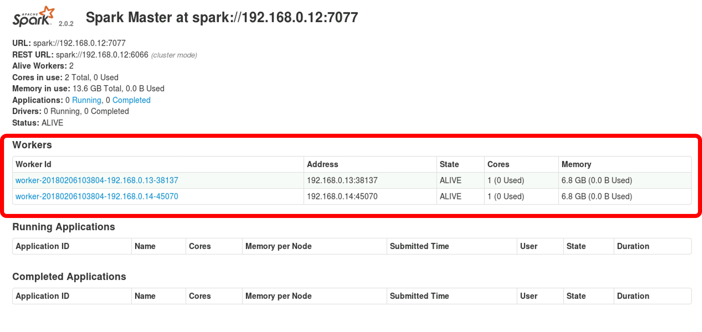
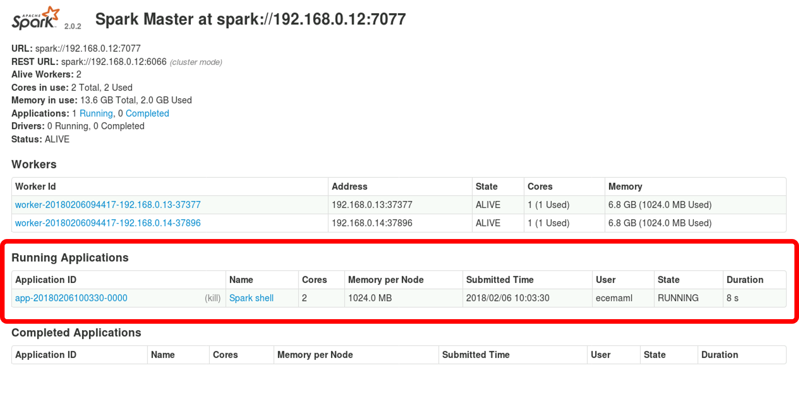
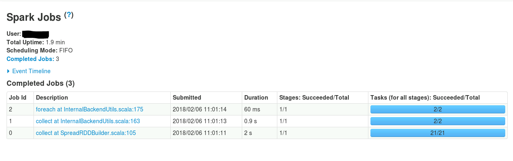
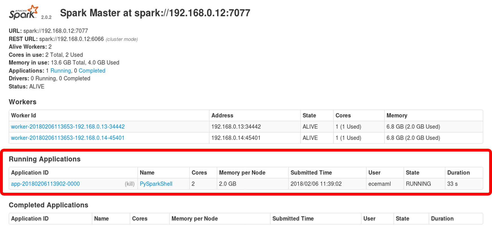
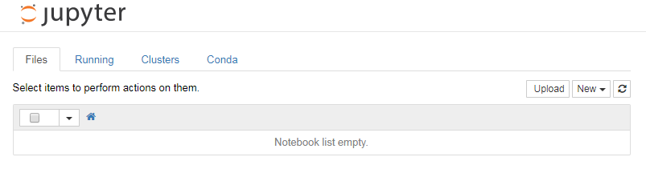

# Sparkling Water setup in a Spark Standalone cluster

1. [Java installation on all instances](#java-installation-on-cluster-instances)
2. [/etc/host upldate on all instances](#etchosts-update-on-all-instances)
3. [Password-less ssh configuration](#password-less-ssh-configuration)
4. [Spark installation on all instances](#spark-installation-on-all-instances)
5. [Python installation and configuration](#python-installation-and-configuration)
6. [Sparkling Water installation](#sparkling-water-installation)
7. [Pysparkling installation](#pysparkling-installation)
8. [Jupyter Notebook configuration](#jupyter-notebook-configuration)

--------

Our environment is made of three instances, one master and two slaves:
 * master (`tb012`), with IP address `192.168.0.12`
 * first slave (`tb013`): with IP address `192.168.0.13`
 * second slave (`tb014`): with IP address `192.168.0.14`
 
The instructions in this document will enable several scenarios:
 * Execution of H2O applications in the H2O Flow Server.
 * Execution of H2O applications as Jupyter notebooks.
 * Execution of H2O applications submitted to the Spark Standalone cluster

## Java installation on cluster instances
Java must be installed in all the cluster instances: ***Oracle Java 8*** has been chosen (some tutorials found on the Internet, such as [this](http://tecadmin.net/install-oracle-java-8-jdk-8-ubuntu-via-ppa/) and [this](http://stackoverflow.com/questions/19275856/auto-yes-to-the-license-agreement-on-sudo-apt-get-y-install-oracle-java7-instal)) are used):

```bash
sudo apt-get update
echo oracle-java8-installer shared/accepted-oracle-license-v1-1 select true | sudo debconf-set-selections
echo oracle-java8-installer shared/accepted-oracle-license-v1-1 seen true | sudo debconf-set-selections
sudo add-apt-repository -y ppa:webupd8team/java
sudo apt-get update
sudo apt-get install -y oracle-java8-installer
sudo apt-get install -y oracle-java8-set-default
```

Verification of a successful Java installacion can be done by typing `java -version` in the console. The output must be similar to this:
```bash
java version "1.8.0_161"
Java(TM) SE Runtime Environment (build 1.8.0_161-b12)
Java HotSpot(TM) 64-Bit Server VM (build 25.161-b12, mixed mode)
```

## Environment variables setup on all instances
In order to determine the actual Java home, the following command can be used:
```bash
readlink -f /usr/bin/java | sed "s:bin/java::"
```

Next, the following environment variable must set in the `.bashrc` file under `/home/ubuntu` (on all the instances):
```bash
echo "
# Set JAVA_HOME 
export JAVA_HOME=$(readlink -f /usr/bin/java | sed "s:bin/java::")" >> ~/.bashrc
```

Once updated, the `.bashrc` file must be reloaded:
```bash
source ~/.bashrc
```

## /etc/hosts update on all instances
The instances must be able to connect to each other. Thus, we add the following lines to the `/etc/hosts` file in each instance:

```bash
echo "
192.168.0.12  cluster-master
192.168.0.13  cluster-slave-1
192.168.0.14  cluster-slave-2" | sudo tee --append /etc/hosts
```

## Password-less ssh configuration
Password-less ssh communication between the master and the slaves is required to set up the Spark cluster. It can be achieved by means of different approaches involving different degrees of security. Here we will describe a generic approach where a new ssh key pair is created and necessary components are distributed to the instances in the cluster.

First, access the master node, create a new pair of keys, and the `authorized_keys` file:
```bash
ssh-keygen -t rsa -P '' -f ~/.ssh/id_rsa
cat ~/.ssh/id_rsa.pub >> ~/.ssh/authorized_keys
```
As a result, there will be three files in the `~/.ssh/` folder: `id_rsa`, `id_rsa.pub` and `authorized_keys`. `id_rsa.pub` can be removed, as it is no longer necessary. Retrieve the two remaining files, upload them to the master instance and move them to the `~/.ssh/` folder. Set the proper permissions:
```bash
chmod 0600 ~/.ssh/id_rsa
chmod 0600 ~/.ssh/authorized_keys
```

Upload `authorized_keys` to the slave instances and move it to the `~/.ssh/` folder. Set the proper permissions:
```bash
chmod 0600 ~/.ssh/authorized_keys
```

Verify that seamless ssh connection is enabled by running the following commands on the master instance:
```bash
ssh -o StrictHostKeyChecking=no cluster-slave-1
ssh -o StrictHostKeyChecking=no cluster-slave-2
``` 

## Spark installation on all instances
A Spark release compatible with Hadoop 2.7.4 and Zeppelin 0.7.2, [Spark 2.0.2](https://spark.apache.org/releases/spark-release-2-0-2.html), is chosen. Use a symbolic link to easily upgrade or change versions if wished.

```bash
wget http://d3kbcqa49mib13.cloudfront.net/spark-2.0.2-bin-hadoop2.7.tgz
tar -zxvf spark-2.0.2-bin-hadoop2.7.tgz
sudo mkdir -p /opt/sparks
sudo mv spark-2.0.2-bin-hadoop2.7 /opt/sparks
sudo ln -s /opt/sparks/spark-2.0.2-bin-hadoop2.7 /usr/local/spark
rm spark-2.0.2-bin-hadoop2.7.tgz
```

### Spark environment variables setup on master and slave nodes
The following environment variables are set in the `.bashrc` file under `/home/<working user id>` (both on master and slave nodes):
```bash
echo '
# Set SPARK_HOME
export SPARK_HOME=/usr/local/spark
# Add Spark bin and sbin directories to PATH
export PATH=$PATH:$SPARK_HOME/sbin:$SPARK_HOME/bin' >> ~/.bashrc
```

The `.bashrc` file is reloaded:
```bash
source ~/.bashrc
```

### Additional Spark configuration
Next, some additional variables in the `spark-env.sh` configuration file are activated and set on the master node:
```bash
cp $SPARK_CONF_DIR/spark-env.sh.template $SPARK_CONF_DIR/spark-env.sh
echo "
export JAVA_HOME=$(readlink -f /usr/bin/java | sed "s:bin/java::")
export SPARK_MASTER_HOST=192.168.0.12
export SPARK_LOCAL_IP=192.168.0.12" >> $SPARK_CONF_DIR/spark-env.sh
```

A similar update is done on the slave nodes (see example for first slave):

```bash
cp $SPARK_CONF_DIR/spark-env.sh.template $SPARK_CONF_DIR/spark-env.sh
echo "
export JAVA_HOME=$(readlink -f /usr/bin/java | sed "s:bin/java::")
export SPARK_MASTER_HOST=192.168.0.12
export SPARK_LOCAL_IP=192.168.0.13" >> $SPARK_CONF_DIR/spark-env.sh
```

It is possible to determine whether the installation has been successful by running the `spark-shell` command in any instance (running `spark-shell` without arguments is equivalent to doing it with `spark-shell --master local[*]`). If we do it on the master instance, the output should be similar to this (to exit the Spark Shell, type CTRL-D):
```bash
Setting default log level to "WARN".
To adjust logging level use sc.setLogLevel(newLevel).
Spark context Web UI available at http://192.168.0.12:4040
Spark context available as 'sc' (master = local[*], app id = local-1517909559935).
Spark session available as 'spark'.
Welcome to
      ____              __
     / __/__  ___ _____/ /__
    _\ \/ _ \/ _ `/ __/  '_/
   /___/ .__/\_,_/_/ /_/\_\   version 2.0.2
      /_/

Using Scala version 2.11.8 (Java HotSpot(TM) 64-Bit Server VM, Java 1.8.0_161)
Type in expressions to have them evaluated.
Type :help for more information.
```
If you try to run `pyspark`, an error will be raised  (sort of "Python not found" error), as python has not been installed yet.

Before leaving the Spark Shell, it is possible to verify the status of the Spark context created upon the execution of the Spark Shell by accessing `http://cluster-master:4040/`:


### Configuration of Spark cluster slaves
In order to let the master know which instances will play the role of slaves, the Spark `slaves` file must be created on the master node. In our scenario, with two slaves:
```bash
echo "cluster-slave-1
cluster-slave-2
" > $SPARK_CONF_DIR/slaves
```

### Cluster start and stop
Connect to the master instance (`<working user id>`:`<working user password>`) and execute the following commands:
```bash
$SPARK_HOME/sbin/start-master.sh
$SPARK_HOME/sbin/start-slaves.sh 
``` 
Instead, it is possible start *Master* and *Workers* at the same time:
```bash
$SPARK_HOME/sbin/start-all.sh 
``` 

To validate the cluster has been successfully started, the JVM Process Status tool can be run on the master and slave instances. The output should list a `Master` on the master node:
```bash
9587 Master
9651 Jps
```

And a `Worker` process in each slave instance:
```bash
13175 Jps
13150 Worker
```

The status of the Spark cluster can be verified in `http://cluster-master:8080/`:



Two workers must appear. No applications (running or completed) are listed and no Spark context UI (`http://cluster-master:8080/`) is available.

To terminate the cluster, you can stop *Master* and *Workers* separately or just with a single command:
```bash
$SPARK_HOME/sbin/stop-master.sh
$SPARK_HOME/sbin/stop-slaves.sh 
``` 
Or:
```bash
$SPARK_HOME/sbin/stop-all.sh 
``` 

For the operation convenience, a script (`restart_all.sh`) is available at `/home/<working user id>` to restart the cluster. Its content can be seen below:
```bash
#!/bin/sh

$SPARK_HOME/sbin/stop-all.sh
$SPARK_HOME/sbin/start-all.sh
```

When the cluster is stopped, the Spark Cluster UI becomes unreachable.

Next, it is possible to verify whether `spark-shell` run against the cluster. First, the cluster is started again (both master and slaves). Next, the `spark-shell` is run with the `master` argument set to the IP address of the Spark Standalone cluster. You can do it from any instance of the cluster or from any other instance in the cloud with the same Spark version:
```bash
spark-shell --master spark://cluster-master:7077
```
Besides some warnings, the output should is something such as this:

```bash
Setting default log level to "WARN".
To adjust logging level use sc.setLogLevel(newLevel).
Spark context Web UI available at http://192.168.0.13:4040
Spark context available as 'sc' (master = spark://cluster-master:7077, app id = app-20180206104842-0000).
Spark session available as 'spark'.
Welcome to
      ____              __
     / __/__  ___ _____/ /__
    _\ \/ _ \/ _ `/ __/  '_/
   /___/ .__/\_,_/_/ /_/\_\   version 2.0.2
      /_/

Using Scala version 2.11.8 (Java HotSpot(TM) 64-Bit Server VM, Java 1.8.0_161)
Type in expressions to have them evaluated.
Type :help for more information.
```

If we verify the status of the Spark cluster (in `http://cluster-master:8080/`), we obtain the following UI:



We find the two existing *Workers* listed in the previous screenshot **and** the Spark Shell as a new *Running Application*. At the same time, the Spark context UI (`http://cluster-manager:4040/`) is available (you can access it by clicking on *Spark shell* uner the *Name* column in the *Running Applications* section).

## Python Installation and Configuration
Python is handled by means of an [Anaconda Distribution](https://www.anaconda.com/distribution/), which is installed on master and slave instances. The release is 4.2.0. It includes not only Python 3.5 but a number of valuable Python packages and Jupyter Notebook as well (a **note about versions**: From 4.4, the Anaconda Distribution is based on Python 3.6; however, Spark 2.0 does not support Python 3.6, so that an earlier version of the Anaconda Distribution is required):

```bash
wget https://repo.continuum.io/archive/Anaconda3-4.2.0-Linux-x86_64.sh
sudo /bin/bash Anaconda3-4.2.0-Linux-x86_64.sh -b -p /usr/local/anaconda
sudo chown -R <working user id>:<working user id> /usr/local/anaconda/
rm Anaconda3-4.2.0-Linux-x86_64.sh
sudo /usr/local/anaconda/bin/conda update -y conda
```

Next, the following environment variables must are set in the `.bashrc` file under `/home/<working user id>` (both on master and slave nodes):
```bash
echo '
# Set ANACONDA_HOME
export ANACONDA_HOME=/usr/local/anaconda
# Add Anaconda bin directory to PATH
export PATH=$ANACONDA_HOME/bin:$PATH' >> ~/.bashrc
```

The `.bashrc` file must reloaded:
```bash
source ~/.bashrc
```

Finally, the right Python version must be configured in the `spark-env.sh` configuration file on all instances in the cluster:

```bash
echo "
export PYSPARK_PYTHON=$ANACONDA_HOME/bin/python" >> $SPARK_CONF_DIR/spark-env.sh
```

If you run `pyspark` (with the same options as with the Spark Shell) a similar result will be obtained (*PySparkShell* as running application instead of *Spark shell*).

## Sparkling Water Installation
(*The description in this section is based on [official documentation](http://h2o-release.s3.amazonaws.com/sparkling-water/rel-2.0/2/index.html) and on a [My Big Data World blog post](https://weidongzhou.wordpress.com/2017/11/06/h2o-vs-sparkling-water/)*) 

As the Sparkling Water release is aligned with the Spark release, we use Sparkling Water 2.0. Download the package and install it in the cluster manager (we're using a symbolic link to enable version upgrade):
 
```bash
wget http://h2o-release.s3.amazonaws.com/sparkling-water/rel-2.0/22/sparkling-water-2.0.22.zip
sudo mkdir -p /opt/sparkling-waters
sudo unzip sparkling-water-2.0.22.zip -d /opt/sparkling-waters
sudo ln -s /opt/sparkling-waters/sparkling-water-2.0.22 /usr/local/sparkling-water
rm sparkling-water-2.0.22.zip
```

The following environment variables must be set in the `.bashrc` file under `/home/<working user id>`:
```bash
echo '
# Set SPARKLING_HOME
export SPARK_HOME=/usr/local/sparkling-water
# Add Sparkling Water bin directory to PATH
export PATH=$PATH:$SPARKLING_HOME/sbin' >> ~/.bashrc
```

Finally, the `.bashrc` file is reloaded:
```bash
source ~/.bashrc
```

It is possible to verify the right installation of Sparkling Water by running the Sparkling Shell (`sparkling-shell` accepts the same arguments as the regular Spark shell):
```bash
sparkling-shell --master spark://cluster-master:7077 \
--conf spark.executor.instances=2 \
--conf spark.executor.memory=2g \
--conf spark.driver.memory=2g \
--conf spark.sql.autoBroadcastJoinThreshold=-1 \
--conf spark.locality.wait=30000 \
--conf spark.scheduler.minRegisteredResourcesRatio=1
```

The output should be something like this (to exit the Sparkling Shell, type CTRL-D) when run on the master instance:

```bash

-----
  Spark master (MASTER)     : spark://cluster-master:7077
  Spark home   (SPARK_HOME) : /usr/local/spark
  H2O build version         : 3.16.0.4 (wheeler)
  Spark build version       : 2.0.2
  Scala version             : 2.11
----

Java HotSpot(TM) 64-Bit Server VM warning: ignoring option MaxPermSize=384m; support was removed in 8.0
Setting default log level to "WARN".
To adjust logging level use sc.setLogLevel(newLevel).
Spark context Web UI available at http://192.168.0.12:4040
Spark context available as 'sc' (master = spark://192.168.0.12:7077, app id = app-20180202113529-0002).
Spark session available as 'spark'.
Welcome to
      ____              __
     / __/__  ___ _____/ /__
    _\ \/ _ \/ _ `/ __/  '_/
   /___/ .__/\_,_/_/ /_/\_\   version 2.0.2
      /_/

Using Scala version 2.11.8 (Java HotSpot(TM) 64-Bit Server VM, Java 1.8.0_161)
Type in expressions to have them evaluated.
Type :help for more information.
```

If you go to the Spark cluster UI, you'll notice, under the **Running Applications** section, a Spark Shell application. As far as Spark is concerned, `sparkling-shell` is simply another Spark Shell. 

Next, let's create an H2O cluster inside the Spark cluster, by running the following code in the Sparkling Shell:
```java
import org.apache.spark.h2o._
val h2oContext = H2OContext.getOrCreate(spark) 
import h2oContext._ 
```

The output when creating the H2O context must be similar to this (notice the two workers):
```bash
h2oContext: org.apache.spark.h2o.H2OContext =

Sparkling Water Context:
 * H2O name: sparkling-water-ecemaml_app-20180206105948-0000
 * cluster size: 2
 * list of used nodes:
  (executorId, host, port)
  ------------------------
  (1,192.168.0.14,54321)
  (0,192.168.0.13,54321)
  ------------------------

  Open H2O Flow in browser: http://192.168.0.12:54321 (CMD + click in Mac OSX)
```

The Spark Context UI (in `http://cluster-master:4040/`) shows the jobs required to create the H2O cluster:



You can access the H2O Flow Server (in `http://cluster-master:54321/`) as well:


## Pysparkling installation
(*The description in this section is based on [official documentation](https://github.com/h2oai/sparkling-water/blob/rel-2.0/py/README.rst) and on a [My Big Data World blog post](https://weidongzhou.wordpress.com/2017/11/06/h2o-vs-sparkling-water/)*) 

In order to use Pysparkling, the H2O dependencies must be installed on all the cluster instances: 

```bash
sudo /usr/local/anaconda/bin/conda install -y -c anaconda requests 
sudo /usr/local/anaconda/bin/conda install -y -c conda-forge tabulate 
sudo /usr/local/anaconda/bin/conda install -y -c conda-forge colorama
sudo /usr/local/anaconda/bin/conda install -y -c conda-forge future
```

Finally, install `pysparkling` on all the cluster instances (use `pip`, as `pysparkling` is not in the Anaconda channels):
```bash
sudo /usr/local/anaconda/bin/pip install h2o_pysparkling_2.0
```

It is possible to verify the right installation of Pysparkling by running it (`pysparkling` accepts the same arguments as the regular Spark `pyspark`):
```bash
pysparkling --master spark://cluster-master:7077 \
--conf spark.executor.instances=2 \
--conf spark.executor.memory=2g \
--conf spark.driver.memory=2g \
--conf spark.sql.autoBroadcastJoinThreshold=-1 \
--conf spark.locality.wait=30000 \
--conf spark.scheduler.minRegisteredResourcesRatio=1
```

Next, we are creating an H2O cluster inside the Spark cluster in order to verify the Pysparkling installation. Once the Pysparkling Shell is opened, we can run the following code:

```python
from pysparkling import *
import h2o
hc = H2OContext.getOrCreate(spark)
```

The output, once the H2O context is created shouls be similar to this:
```python
Connecting to H2O server at http://192.168.0.12:54321... successful.
--------------------------  -----------------------------------------------
H2O cluster uptime:         20 secs
H2O cluster version:        3.16.0.4
H2O cluster version age:    21 days, 13 hours and 50 minutes
H2O cluster name:           sparkling-water-ecemaml_app-20180206113441-0003
H2O cluster total nodes:    2
H2O cluster free memory:    3.644 Gb
H2O cluster total cores:    2
H2O cluster allowed cores:  2
H2O cluster status:         accepting new members, healthy
H2O connection url:         http://192.168.0.12:54321
H2O connection proxy:
H2O internal security:      False
H2O API Extensions:         XGBoost, Algos, AutoML, Core V3, Core V4
Python version:             3.5.2 final
--------------------------  -----------------------------------------------

Sparkling Water Context:
 * H2O name: sparkling-water-ecemaml_app-20180206113441-0003
 * cluster size: 2
 * list of used nodes:
  (executorId, host, port)
  ------------------------
  (0,192.168.0.14,54321)
  (1,192.168.0.13,54321)
  ------------------------

  Open H2O Flow in browser: http://192.168.0.12:54321 (CMD + click in Mac OSX)
```

As with the Sparkling Shell, it is possible to inspect the Spark cluster status by accessing the cluster UI (in `http://cluster-master:8080/`):



The Spark context UI shows a similar layout to that of the Sparkling Shell.

## H2O applications run as Jupyter notebooks
Jupyter can be used to run Pyspark applications as notebooks. It is possible to use it to run Pysparkling applications as well.
 
### Jupyter Notebook configuration
 First, some configuration for making the Notebook server be accessible from sites other than the localhost is needed. A configuration file for Jupyter Notebook must be created on the master instance (the file is needed for enabling access to the Notebook server):

```bash
/usr/local/anaconda/bin/jupyter notebook --generate-config -y
```

As a result, `~/.jupyter/jupyter_notebook_config.py` is created. Some settings in the configuration file must be updated as well in order to:
* Know which folder for notebooks and kernels must use.
* Enable access to the Notebook server from clients other than `localhost`. By default the Notebook server only listens on the `localhost` network interface. To enable connection from any client, the Notebook server must listen on all network interfaces and not open the browser.
* Tune the security settings. Security in the Jupyter Notebook server is enabled by requesting an authentication token, created when Jupyter is run from the command line. As access to the command line is not always possible, two different options can be taken:
  1. Enabling a password. This is the preferred option.
  2. Disabling the authentication. This option is discouraged.

#### Notebooks folder
The folder that hosts notebooks and kernels is created and proper permissions assigned:
```bash
sudo mkdir /srv/notebooks
sudo chown <working user id>:<working user id> ./notebooks/
```

Next, the Jupyter Notebook configuration file, `~/.jupyter/jupyter_notebook_config.py`, is updated to use the just created folder, by activating the `c.NotebookApp.notebook_dir` setting:
```bash
sed -i "s/#c.NotebookApp.notebook_dir = ''/c.NotebookApp.notebook_dir = '\/srv\/notebooks'/" ~/.jupyter/jupyter_notebook_config.py
```

#### Noteboook Server access
For making the server accessible from any client, the following settings must be activated and/or modified: `c.NotebookApp.ip`, and `c.NotebookApp.open_browser` (see [Running a public Notebook server](http://jupyter-notebook.readthedocs.io/en/latest/public_server.html#running-a-public-notebook-server)). It allows to access the server from clients other than the `localhost` and not to start the browser when `jupyter notebook` is run:
```bash
sed -i "s/#c.NotebookApp.ip = 'localhost'/c.NotebookApp.ip = '*'/" ~/.jupyter/jupyter_notebook_config.py
sed -i "s/#c.NotebookApp.open_browser = True/c.NotebookApp.open_browser = False/" ~/.jupyter/jupyter_notebook_config.py
```
The Jupyter Notebook server can be accessed in `http://cluster-manager:8888/`:

Finally, some considerations about the security. The configuration above sets up a public Notebook server. Security is enabled by requesting an authentication token to access the server (the token is created when Jupyter is run from the command line). Two options are considered

##### Disabling token authentication (discouraged)
```bash
sed -i "s/#c.NotebookApp.token = '<generated>'/c.NotebookApp.token = ''/" ~/.jupyter/jupyter_notebook_config.py
```

##### Enabling password authentication
If using `my_password` as password:
```bash
sed -i "s/#c.NotebookApp.password = ''/c.NotebookApp.password = 'my_password'/" ~/.jupyter/jupyter_notebook_config.py
```

### Configuration for running notebooks
The configuration described in the section above just enables an open access to the server. However, it is necessary to trigger the access to the Notebook server when Pysparkling is run. It is done by updating the `spark-env.sh` configuration file on the master instance:

```bash
echo '
export PYSPARK_DRIVER_PYTHON=jupyter
export PYSPARK_DRIVER_PYTHON_OPTS="notebook"' >> $SPARK_CONF_DIR/spark-env.sh
```

The execution of Jupyter Notebook is triggered when `pysparkling`, with proper options, is run. An output similar to this is printed in the console:

```bash
[I 18:03:58.858 NotebookApp] [nb_conda_kernels] enabled, 3 kernels found
[W 18:03:58.890 NotebookApp] WARNING: The notebook server is listening on all IP addresses and not using encryption. This is not recommended.
[W 18:03:58.891 NotebookApp] WARNING: The notebook server is listening on all IP addresses and not using authentication. This is highly insecure and not recommended.
[I 18:03:58.985 NotebookApp] ✓ nbpresent HTML export ENABLED
[W 18:03:58.985 NotebookApp] ✗ nbpresent PDF export DISABLED: No module named 'nbbrowserpdf'
[I 18:03:59.062 NotebookApp] [nb_anacondacloud] enabled
[I 18:03:59.066 NotebookApp] [nb_conda] enabled
[I 18:03:59.070 NotebookApp] Serving notebooks from local directory: /srv/notebooks
[I 18:03:59.070 NotebookApp] 0 active kernels
[I 18:03:59.071 NotebookApp] The Jupyter Notebook is running at: http://[all ip addresses on your system]:8888/
[I 18:03:59.071 NotebookApp] Use Control-C to stop this server and shut down all kernels (twice to skip confirmation).
```

At the same time, the Jupyter Notebook server is accessible in `http://cluster-master:8888/`:



Once the *kernel* is loaded, it is possible to start to create and execute H2O applications as Jupyter notebooks. The Jupyter Notebook server can be terminated by typing CTRL-C.