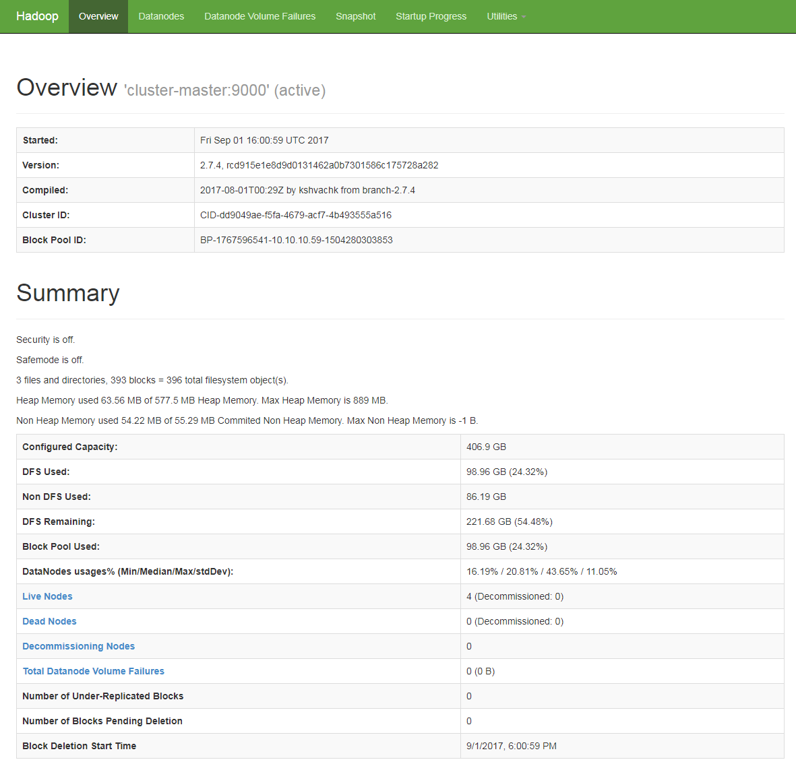

# Setting up an HDFS cluster
This tutorial is based on [the official Hadoop documentation](https://hadoop.apache.org/docs/r2.7.2/hadoop-project-dist/hadoop-common/ClusterSetup.html) and [other resources found on the Internet](https://chawlasumit.wordpress.com/2015/03/09/install-a-multi-node-hadoop-cluster-on-ubuntu-14-04/). It is important to note that as new releases come out, some properties become deprecated and old tutorials are no longer entirely valid (see the [list of deprecated properties](https://hadoop.apache.org/docs/stable/hadoop-project-dist/hadoop-common/DeprecatedProperties.html)).

This tutorial assumes that [several instances have been created on an Openstack cloud](doc/environment-description.md). No specific dependencies to this type of cloud (beyond the handling of private/public -floating- IP addresses) have been detected so that the procedures should provide relevant information for setting up a cluster in many environments.

* [Components of the cluster](#components-of-the-cluster)
* [Java installation on all instances](#java-installation-on-all-instances)
* [Hadoop installation on all the instances](#hadoop-installation-on-all-the-instances)
* [Hadoop environment variables setup on master and slave nodes](#hadoop-environment-variables-setup-on-master-and-slave-nodes)
* [*ssh* installation on all instances](#ssh-installation-on-all-instances)
* [`/etc/hosts` update in all instances](#etchosts-update-in-all-instances)
* [Cluster instances configuration](#instance-configuration)
* [Password-less *ssh* setup](#password-less-ssh-setup)
* [HDFS filesystem format via the *NameNode*](#hdfs-filesystem-format-via-the-namenode)
* [Distributed File System start and stop](#distributed-file-system-start-and-stop)
* [Key take-aways](#key-take-aways)
* [See also](#see-also)

----

## Components of the cluster
The HDFS cluster will be made of four nodes: one master (`cluster-master`) and three slaves (`cluster-slave-1`, `cluster-slave-2` and `cluster-slave-3`). Slaves will run a *DataNode* each, while only a *NameNode* will run on the master node (initial configurations deployed also a *DataNode* in the master node, but this configuration did not work as the *NameNode* run out of resources frequently (see [Key take-aways](#key-take-aways)).

## Java installation on all instances
Java must be installed in all the cluster instances: Oracle Java 8 has been chosen (some tutorials found on the Internet, such as [this](http://tecadmin.net/install-oracle-java-8-jdk-8-ubuntu-via-ppa/) and [this](http://stackoverflow.com/questions/19275856/auto-yes-to-the-license-agreement-on-sudo-apt-get-y-install-oracle-java7-instal)) are used):

```bash
sudo apt-get update
echo oracle-java8-installer shared/accepted-oracle-license-v1-1 select true | sudo debconf-set-selections
echo oracle-java8-installer shared/accepted-oracle-license-v1-1 seen true | sudo debconf-set-selections
sudo add-apt-repository -y ppa:webupd8team/java
sudo apt-get update
sudo apt-get install -y oracle-java8-installer
sudo apt-get install -y oracle-java8-set-default
```

Verification of a successful Java installacion can be done by typing `java -version` in the console. The output must be something like this:
```bash
java version "1.8.0_144"
Java(TM) SE Runtime Environment (build 1.8.0_144-b01)
Java HotSpot(TM) 64-Bit Server VM (build 25.144-b01, mixed mode)
```

## Hadoop installation on all the instances
Hadoop is needed to create an HDFS cluster: [Hadoop 2.7.4](http://hadoop.apache.org/docs/r2.7.4/) will be used.
```bash
wget http://ftp.cixug.es/apache/hadoop/common/hadoop-2.7.4/hadoop-2.7.4.tar.gz
tar -xvzf hadoop-2.7.4.tar.gz
sudo mv hadoop-2.7.4 /usr/local/hadoop
rm hadoop-2.7.4.tar.gz
```

## Hadoop environment variables setup on master and slave nodes
In order to determine the actual Java home, the following command can be used:
```bash
readlink -f /usr/bin/java | sed "s:bin/java::"
```

Next, the following environment variables are set in the `.bashrc` file under `/home/ubuntu` (both on master and slave nodes):
```bash
echo '
# Set HADOOP_HOME
export HADOOP_HOME=/usr/local/hadoop
# Set $HADOOP_CONF_DIR
export HADOOP_CONF_DIR=$HADOOP_HOME/etc/hadoop
# Set $HADOOP_LOG_DIR
export HADOOP_LOG_DIR=$HADOOP_HOME/logs
# Set JAVA_HOME 
export JAVA_HOME=/usr/lib/jvm/java-8-oracle/jre
# Add Hadoop bin and sbin directory to PATH
export PATH=$PATH:$HADOOP_HOME/bin:$HADOOP_HOME/sbin
' >> ~/.bashrc
```

Once updated, the `.bashrc` file must be reloaded:
```bash
source ~/.bashrc
```

Finally, the `$JAVA_HOME` variable has to be updated in the `hadoop_env.sh` configuration file on master and slave nodes:

```bash
sed -i 's/export JAVA_HOME=${JAVA_HOME}/#export JAVA_HOME=${JAVA_HOME}\nexport JAVA_HOME=$(readlink -f \/usr\/bin\/java | sed "s:bin\/java::")/' $HADOOP_CONF_DIR/hadoop-env.sh
```

## ssh installation on all instances
```bash
sudo apt-get update
sudo apt-get install ssh -y
```

## /etc/hosts update in all instances
Here it is important to note that private IP addresses must be used in this file (no floating IP addresses are involved here).

```bash
echo "
<master-ip-address>		cluster-master
<slave-1-ip-address>	cluster-slave-1
<slave-2-ip-address>	cluster-slave-2
<slave-3-ip-address>	cluster-slave-3
" | sudo tee --append /etc/hosts
```

## Password-less ssh setup
### Option 1: password-less by means of the cloud key
Enabling password-less ssh connection between the instances can be tricky, as only password-less ssh connections to the instances in the Openstack cloud are enabled. Password-less connections use the cloud private key employed to deploy the instances (named `lab`). That is, any instance in the considered Openstack cloud already accepts ssh connections from clients with the `lab` private key. Thus, making the private key available in the master note would be enough (if unsure about security, mind that any user able to connect to any Openstack instance already have the private key).

That is, the simplest way to enable the ssh connection is simply to copy the `lab` key (with OpenSSH format) to the `/home/ubuntu/.ssh` folder in the master node (using any secure FTP client). As PuTTY is used to handle connections, a private key with proper OpenSSH format would have to be obtained from `lab.ppk`. It can be done by means of PuTTYgen, by loading the private key and exporting it as an OpenSSH key. The resulting private key will be named `id_rsa` and subsequently uploaded to the master instance.

Once in the proper folder, the key file must be given the right permissions:
```bash
chmod 0600 ~/.ssh/id_rsa
```

Finally, the connection can be tested by using the following command (`StrictHostKeyChecking=no` can be used to avoid an interactive dialogue in the first connection):
```bash
ssh -o StrictHostKeyChecking=no cluster-slave-1
ssh -o StrictHostKeyChecking=no cluster-slave-2
ssh -o StrictHostKeyChecking=no cluster-slave-3
```

### Option 2: creation of a new key pair and distribution from the master instance
If permanently leaving the cloud private key in the master instance is not acceptable, an alternative schema can be used. It uses the cloud private key only to upload a new key to the slave instances. Once they are uploaded, the cloud private key is removed from the master instance. First, the procedures to handle the `lab` private key in the master instance described previously (upload and permissions set) are followed. The result will be having a private key with proper permissions in `~/.ssh/id_rsa` at the master instance.

Next, a new pair of public/private keys is generated in the master instance (mind the new key names in order not to overwrite the existing key).
```bash
ssh-keygen -t rsa -P '' -f ~/.ssh/idhdfs_rsa
cat ~/.ssh/idhdfs_rsa.pub >> ~/.ssh/authorized_keys
chmod 0600 ~/.ssh/authorized_keys
```

Once created, the new public key is uploaded to the slaves by means of `ssh-copy-id`. 
```bash
for x in cluster-slave-1 cluster-slave-2 cluster-slave-3; do ssh-copy-id -i ~/.ssh/idhdfs_rsa.pub $x; done
```

Finally, the `lab` private key (`id_rsa`) is deleted, and the newly-created pair of keys is renamed so that the default key file names are used:
```bash
rm ~/.ssh/id_rsa
mv ~/.ssh/idhdfs_rsa ~/.ssh/id_rsa
mv ~/.ssh/idhdfs_rsa.pub ~/.ssh/id_rsa.pub
```
From that point on, this new key pair is the one that will be used in the communications between the master and the slave instances:

Verify that seamless ssh connection is enabled by running the following commands on the master instance:
```bash
ssh -o StrictHostKeyChecking=no cluster-slave-1
ssh -o StrictHostKeyChecking=no cluster-slave-2
ssh -o StrictHostKeyChecking=no cluster-slave-3
```

### Option 3: creation of a new key pair and distribution from a different instance
It is possible not to expose at all the cloud private key. A new pair of keys and a proper `authorized_keys` file are created out-of-the-box (for instance, in another instance of the cloud) and delivered to the members of the cluster.

First, access to an instance in the cloud following the usual procedure (that is, password-less). Create a new pair of keys:
```bash
cp ~/.ssh/authorized_keys ~/.ssh/authorized_keys_original
ssh-keygen -t rsa -P '' -f ~/.ssh/id_rsa
cat ~/.ssh/id_rsa.pub >> ~/.ssh/authorized_keys
```
There will be three files in the `~/.ssh/` folder: `id_rsa`, `id_rsa.pub` and `authorized_keys` (besides the old `authorized_keys`, now `authorized_keys_original`). Remove `id_rsa.pub`, as it is no longer necessary. Retrieve the two remaining files (now you can restore the old `~/.ssh/authorized_keys_original`), upload them to the master instance and move them to the `~/.ssh/` folder (replace the file ` ~/.ssh/authorized_keys` with the one it has been uploaded). Set the proper permissions:
```bash
chmod 0600 ~/.ssh/id_rsa
chmod 0600 ~/.ssh/authorized_keys
```

Upload `authorized_keys` to the slave instances and move it to the `~/.ssh/` folder, replacing the already existing in there. Set the proper permissions:
```bash
chmod 0600 ~/.ssh/authorized_keys
```

Verify that seamless ssh connection is enabled by running the following commands on the master instance:
```bash
ssh -o StrictHostKeyChecking=no cluster-slave-1
ssh -o StrictHostKeyChecking=no cluster-slave-2
ssh -o StrictHostKeyChecking=no cluster-slave-3
```

## Instance configuration
Three configuration files have to be updated on master and slave instances in order to have the cluster configured: `core-site.xml`, `hdfs-site.xml`, and `slaves` (mind that some variables have been deprecated as new versions of Hadoop come out, be aware of that). They are available in the directory `$HADOOP_CONF_DIR`. Although there are some options that are only relevant for the master, it is simpler to copy the same configuration files to all the instances in the cluster.

### `core-site.xml`
First, `core-site.xml` must be updated on all instances (master and slaves), in order to set the properties `hadoop.tmp.dir` and `fs.defaultFS`:
```bash
echo '<?xml version="1.0" encoding="UTF-8"?>
<?xml-stylesheet type="text/xsl" href="configuration.xsl"?>

<configuration>
  <property>
    <name>hadoop.tmp.dir</name>
    <value>file:///usr/local/hadoop/tmp</value>
  </property>
  <property>
    <name>fs.defaultFS</name>
     <value>hdfs://cluster-master:9000</value>
  </property>
</configuration>
' > $HADOOP_CONF_DIR/core-site.xml
```

### `hdfs-site.xml`
`hdfs-site.xml` must be updated on master and slave nodes in order to activate the properties `dfs.replication`, `dfs.namenode.name.dir`, and `dfs.datanode.name.dir`. Default values can be found [here](https://hadoop.apache.org/docs/stable/hadoop-project-dist/hadoop-hdfs/hdfs-default.xml):
```bash
echo '<?xml version="1.0" encoding="UTF-8"?>
<?xml-stylesheet type="text/xsl" href="configuration.xsl"?>
<configuration>
  <property>
  <name>dfs.replication</name>
    <value>3</value>
  </property>
  <property>
    <name>dfs.namenode.name.dir</name>
    <value>file:///home/ubuntu/hdfs/namenode</value>
  </property>
  <property>
    <name>dfs.datanode.data.dir</name>
    <value>file:///home/ubuntu/hdfs/datanode</value>
  </property>
</configuration>
' > $HADOOP_CONF_DIR/hdfs-site.xml
```

Some remarks about the variables:
* `dfs.replication`: it specifies the default block replication. That is, it defines how many machines a single file should be replicated to before it becomes available. If its value is set to a value higher than the number of available slaves (actually *DataNodes*), there will errors. The default value is 3. As three slaves are available, `dfs.replication` is set to 3.
* `dfs.namenode.name.dir`: Directory is used by the *NameNode* to store its metadata file. Thus, manual creation of the directory on all nodes is required.
* `dfs.datanode.name.dir`: Directory is used by *DataNodes* to store its metadata file. Thus, manual creation of the directory om all nodes is required.

```bash
rm -r /home/ubuntu/hdfs/namenode
mkdir -p /home/ubuntu/hdfs/namenode
rm -r /home/ubuntu/hdfs/datanode
mkdir -p /home/ubuntu/hdfs/datanode
```

### `slaves`
Finally, the `slaves` file is updated, only on the master node:
```bash
echo "cluster-slave-1
cluster-slave-2
cluster-slave-3
" >> $HADOOP_CONF_DIR/slaves
```

## HDFS filesystem format via the *NameNode*
It can be done by means of the HDFS CLI (mind that if the filesystem is formatted again in some time in the future, there will be errors related to inconsistent clusterID; *DataNodes* on slave instances will keep the reference to the old *NameNode* and thus deletion and recreation of data folders will be needed):
```bash
$HADOOP_HOME/bin/hdfs namenode -format
```

## Distributed File System start and stop
Although it is possible to start HDFS and YARN daemons at once, it is better to run them separately, obviously if YARN is not needed. The scripts for starting and stopping the HDFS and YARN daemons are available in the `$HADOOP_HOME/sbin` folder. HDSF daemons are started by running, only in the master node, the following script:
```bash
$HADOOP_HOME/sbin/start-dfs.sh
```

To validate it has started successfully, the JVM Process Status tool (`jps` command) can be run on the master and slave instances. The output should list `NameNode` and `SecondaryNameNode` on the master node:
```bash
16947 NameNode
17324 SecondaryNameNode
17470 Jps
```

And a `DataNode` in each slave instance.

If this output is not got on all the instances of the cluster, it is necessary to analyze the log files available at `HADOOP_LOG_DIR`. Relevant log files are `hadoop-ubuntu-datanode-cluster-master.log`, `hadoop-ubuntu-namenode-cluster-master.log`, and `hadoop-ubuntu-secondarynamenode-cluster-master.log`.

The status of the HDFS cluster can be verified in the [HDFS Web Interface](https://hadoop.apache.org/docs/r2.7.4/hadoop-project-dist/hadoop-hdfs/HdfsUserGuide.html#Web_Interface) at `http://<master-floating-ip-address>:50070/`:



To stop the HDFS cluster, simply type:
```bash
$HADOOP_HOME/sbin/stop-dfs.sh
```

## Data load
Once the HDFS cluster is running, it is possible to upload data to it by using the [HDFS File System (FS) shell](https://hadoop.apache.org/docs/r2.7.4/hadoop-project-dist/hadoop-common/FileSystemShell.html). For instance, once a file (`DWFET_CDR_CELLID_201602.csv`) has been uploaded to the master node, it is stored in HDFS:
```bash
hdfs dfs -mkdir /data
hdfs dfs -put DWFET_CDR_CELLID_201602.csv /data
```
In order to verify that the file has been loaded, the HDFS Web Interface (`http://<master-floating-ip-address>:50070/` > Utilities > Browse the file system) can be used:


The whole data load process is described in [Data load](./data-load.md).

## Key take-aways
Works such as *[Spark in action](https://www.manning.com/books/spark-in-action)* (Manning, 2017) state that "The installation [of YARN and Hadoop] is straightforward", but depending on the environment it can be not totally true. The main issues addressed when setting up the HDFS cluster in the considered scenario (Openstack cloud with Ubuntu 16.04 instances) are the following ones:
* Private IP addresses must be used when referring to the cluster instances in the configuration files. If floating IP addresses are used, it will be not possible to connect any instance to each other. It is possible to override this behavior and use the floating IP addresses by setting the properties `*-bind-host` in `hdfs-site.xml` to 0.0.0.0 (see the [official guidelines for HDFS multihoming environments](https://hadoop.apache.org/docs/r2.8.0/hadoop-project-dist/hadoop-hdfs/HdfsMultihoming.html#Ensuring_HDFS_Daemons_Bind_All_Interfaces)), but this kind of configuration is not possible in Spark.
* Careless password-less ssh setup may lead to exposing the cloud private IP address: it is much more secure to use a key pair just for the cluster. It is created out of the box and the private key uploaded to the master instance. Slave instances do not even need the public key, but only the `authorized_keys` file created as part of the key pair generation process.
* The *NameNode* is a single point of failure in the HDFS cluster. Hosting the *NameNode* and a *DataNode* in the same instance may translate into resource shortage in the *NameNode* and the usual `Name node is in safe mode. Resources are low on NN. Please add or free up more resources then turn off safe mode manually` error message. Although the desployment started initially with a *DataNode* in the master instance, it was finally removed.

## See also
* [Running a Spark Standalone cluster](./spark-standalone-cluster-setup.md)
* [Deploying YARN on a Hadoop cluster](./yarn-cluster-setup.md)
* [Running a Spark cluster on YARN](./spark-yarn-cluster-setup.md)
