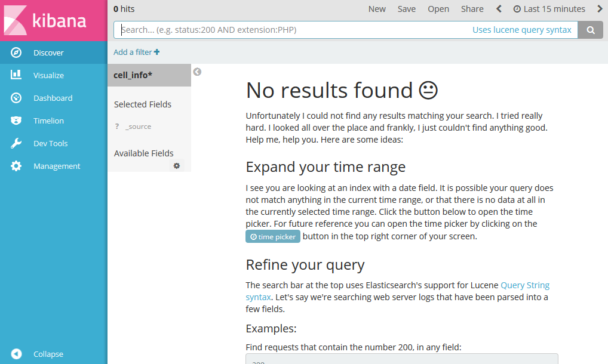

# Saving data to Elasticsearch indices
The [Elastic Stack](https://www.elastic.co/products) (formerly the ELK Stack) is a set of open source tools to search, analyze and visualize data in real time. Although the combination of Jupyter notebooks with `matplotlib` provides a compelling way of showing results, there are situations in which a more powerful tool is required. Thus, the following guidelines will describe how to set up and configure a Elastic Stack instance and how to make it accessible from a Spark Standalone cluster.

* [Pre-requisites](#pre-requisites)
* [Elastic Stack deployment](#elastic-stack-deployment)
* [Elasticdump installation in the host instance](#elasticdump-installation-in-the-host-instance)
* [Elasticsearch index definition](#elasticsearch-index-definition)
  * [Index mapping creation via elasticdump](#index-mapping-creation-via-elasticdump)
  * [Index mapping creation via the web interface](#index-mapping-creation-via-the-web-interface)
* [Elasticsearch connector deployment in the Spark cluster](#elasticsearch-connector-deployment-in-the-spark-cluster)
* [Elasticsearch configuration in the Spark cluster](#elasticsearch-configuration-in-the-spark-cluster)
* [Writing to an Elasticsearch index from the Spark cluster](#writing-to-an-elasticsearch-index-from-the-spark-cluster)
  * [Access to the *elasticsearch-hadoop* binaries](#access-to-the-elasticsearch-hadoop-binaries)
  * [Configuration settings](#configuration-settings)
  * [Write operation from Pyspark](#write-operation-from-pyspark)
* [See also](#see-also)

----
## Pre-requisites
The deployment of Elastic Stack on an Openstack instance will be carried out by means of Docker containers running official Elastic images. Thus, Docker CE and Docker Compose have to be installed before the containers can be created. It can be done by executing a shell script with the following content (taken from the official Docker documentation on [Docker CE](https://docs.docker.com/engine/installation/linux/ubuntu/) and [Docker Compose](https://docs.docker.com/compose/install/)):

```bash
#!/bin/sh

# Docker installation
echo "installing Docker CE"
sudo apt-get update -y
sudo apt-get install linux-image-extra-$(uname -r) linux-image-extra-virtual -y
sudo apt-get install apt-transport-https ca-certificates curl software-properties-common -y
curl -fsSL https://download.docker.com/linux/ubuntu/gpg | sudo apt-key add -
sudo add-apt-repository "deb [arch=amd64] https://download.docker.com/linux/ubuntu $(lsb_release -cs) stable"

sudo apt-get update -y
sudo apt-get install docker-ce -y

# Docker Compose Installation
echo "installing Docker Compose"
sudo apt-get install software-properties-common -y
sudo apt-add-repository universe -y
sudo apt-get update -y
sudo apt-get install python-pip -y
sudo pip install --upgrade pip
sudo pip install docker-compose
```

The shell script, [`docker_install.sh`](https://github.com/miguel-angel-monjas/master-thesis/blob/master/elastic/docker_install.sh) is availabe in the `elastic` folder in the Github repo. 

Next, we execute the following commands in order to enable docker use without `sudo` privileges (from [here] (https://docs.docker.com/engine/installation/linux/linux-postinstall/)):
```bash
sudo groupadd docker
sudo usermod -aG docker ubuntu
```

Finally, a limit on mmap counts equal to 262,144 or more has to be set. It can be done by executing the following command (see the [official documentation](https://www.elastic.co/guide/en/elasticsearch/reference/current/vm-max-map-count.html)):

```bash
sudo sysctl -w vm.max_map_count=262144
```

## Elastic Stack deployment
Deployment of the Elastic Stack environment (with two Elasticsearch instances, and one each for Kibana and Logstash) is based on the [Docker ELK stack distribution by Anthony Lapenna (*deviantony*)](https://github.com/deviantony/docker-elk) and on the [official Elastic documentation](https://www.elastic.co/guide/en/elasticsearch/reference/current/docker.html) (in order to create a two instance Elasticsearch cluster). A conventient feature of deviantony's distribution is the possibility of configure each service defined in the Docker Compose file. In all of them, the X-Pack has been disabled according to the [official](https://www.elastic.co/guide/en/x-pack/current/xpack-settings.html) [documentation](https://www.elastic.co/guide/en/x-pack/current/installing-xpack.html#xpack-enabling)). Logstash is installed to enable integration scenarios where the results of Spark processing are not directly written to Elasticsearch but through CSV files. Thus, the following steps have to be followed:

The files Docker Compose uses are downloaded by cloning a Github repo:

```bash
cd
git clone https://github.com/miguel-angel-monjas/docker-elastic.git
```

Thus, the folder structure in the Elastic Stack instance will be as follows (from `/home/ubuntu/docker-elastic`):
```bash
.
+-- docker-compose.yml
+-- kibana
    +-- config
        +-- kibana.yml
+-- LICENSE
+-- logstash
    +-- config
        +-- logstash.yml
    +-- input
    +-- pipeline
        +-- logstash.conf
```

The following folders are created:
* `kibana\config`: folder where the Kibana configuration file, `kibana.yml` is available.
* `logstash\config`: folder where the Logstash configuration file, `logstash.yml` is available.
* `logstash\pipeline`: folder where the Logstash pipeline file, `logstash.conf` is available.
* `logstash\input`: folder where files to be processed by Logstash are placed.

A Docker Compose file, `docker-compose.yml`, is available in the root folder (`/home/ubuntu/docker-elastic`), with the following content:
```yaml
version: '2'

services:
  elasticsearch:
    image: docker.elastic.co/elasticsearch/elasticsearch:5.6.1
    container_name: elasticsearch
    volumes:
      #### Uncomment if specific Elasticsearch configuration is required	
      # - ./elasticsearch/config/elasticsearch.yml:/usr/share/elasticsearch/config/elasticsearch.yml
      - esdata1:/usr/share/elasticsearch/data
    ports:
      - "9200:9200"
      - "9300:9300"
    environment:
      ES_JAVA_OPTS: "-Xmx2g -Xms2g"
      cluster.name: "docker-cluster"
      bootstrap.memory_lock: "true"
      xpack.security.enabled: "false"
      xpack.monitoring.enabled: "false"
      xpack.ml.enabled: "false"
      xpack.watcher.enabled: "false"
    ulimits:
      memlock:
        soft: -1
        hard: -1
      nofile:
        soft: 65536
        hard: 65536
    mem_limit: 1g
    cap_add:
      - IPC_LOCK
    networks:
      - elk

  elasticsearch2:
    image: docker.elastic.co/elasticsearch/elasticsearch:5.6.1
    container_name: elasticsearch2
    volumes:
      #### Uncomment if specific Elasticsearch configuration is required	
      # - ./elasticsearch/config/elasticsearch.yml:/usr/share/elasticsearch/config/elasticsearch.yml
      - esdata2:/usr/share/elasticsearch/data
    environment:
      ES_JAVA_OPTS: "-Xmx2g -Xms2g"
      cluster.name: "docker-cluster"
      bootstrap.memory_lock: "true"
      discovery.zen.ping.unicast.hosts: "elasticsearch"
      xpack.security.enabled: "false"
      xpack.monitoring.enabled: "false"
      xpack.ml.enabled: "false"
      xpack.watcher.enabled: "false"
    ulimits:
      memlock:
        soft: -1
        hard: -1
      nofile:
        soft: 65536
        hard: 65536
    mem_limit: 1g
    cap_add:
      - IPC_LOCK
    networks:
      - elk

  kibana:
    image: docker.elastic.co/kibana/kibana:5.6.1
    container_name: kibana
    volumes:
      - ./kibana/config/:/usr/share/kibana/config
    ports:
      - "5601:5601"
    networks:
      - elk
    depends_on:
      - elasticsearch

  logstash:
    image: docker.elastic.co/logstash/logstash:5.6.1
    container_name: logstash
    volumes:
      - ./logstash/config/logstash.yml:/usr/share/logstash/config/logstash.yml
      - ./logstash/pipeline:/usr/share/logstash/pipeline
      - ./logstash/input:/tmp
    ports:
      - "5001:5000"
    environment:
      LS_JAVA_OPTS: "-Xms1g -Xmx1g"
    networks:
      - elk
    depends_on:
      - elasticsearch

volumes:
  esdata1:
    driver: local
  esdata2:
    driver: local

networks:
   elk:
      driver: bridge
```

Some aspects to remark:
* Storage in the Elasticsearch cluster is persistent, as two volumes in the host machine, handled by Docker, are used: `esdata1` and `esdata2`. That is, although the containers are stopped, storage is kept. The volumes contents can be erased by removing the volumes (`docker volume rm dockerelastic_esdata1` and `docker volume rm dockerelastic_esdata2`).
* Three ports are exposed so that it is possible to interact with the components of the Elastic Stack: 9200 for Elasticsearch, 5601 for Kibana and 5001 for Logstash (that is, `<elk-floating-ip-address>:9200`, `<elk-floating-ip-address>:5601` and `<elk-floating-ip-address>:5001`).

A Kibana configuration file, `kibana.yml`, is provided:
```yaml
server.name: kibana
server.port: 5601
server.host: 0.0.0.0

elasticsearch.url: http://elasticsearch:9200

xpack.security.enabled: false
xpack.monitoring.enabled: false
xpack.ml.enabled: false
xpack.graph.enabled: false
xpack.reporting.enabled: false
xpack.grokdebugger.enabled: false

http.cors.allow-origin: "/.*/"
http.cors.enabled: true
```

And a Logstash configuration file, `logstash.yml`, is provided:
```yaml
http.host: "0.0.0.0"
path.config: /usr/share/logstash/pipeline

xpack.monitoring.enabled: false
```

Finally, the Elastic Stack infrastructure can be started by executing the following commands:
```bash
cd /home/ubuntu/elk
docker-compose up -d
```

The result should be similar to this:
```bash
Creating network "dockerelastic_elk" with the default driver
Creating volume "dockerelastic_esdata2" with local driver
Creating volume "dockerelastic_esdata1" with local driver
Creating elk_elasticsearch2_1 ...
Creating elasticsearch ...
Creating elk_elasticsearch2_1
Creating elasticsearch ... done
Creating kibana ...
Creating logstash ...
Creating kibana
Creating logstash ... done
```
It is possible to verify the right installation of the Elastic Stack by accessing `http://<elk-floating-ip-address>:5601`. The Kibana web UI should be shown. It is possible to verify the right initialization of the containers by typing `docker ps` and verifying that all the containers are running or to inspects the logs by typing `docker logs elasticsearch`, `docker logs kibana`... (Kibana is usually the component that takes more time to start: *Optimizing and caching bundles for kibana, stateSessionStorageRedirect, timelion and status_page. This may take a few minutes*):



## Elasticdump installation in the host instance
In the following sections, different approaches to save the results of Spark computations in Elasticsearch will be provided. One of them is based on `elasticdump`. Its installation in Ubuntu can be troublesome as `elasticdump` relies on `nodejs` and the installation of the latter in the usual way (that is, by running ```sudo apt-get install nodejs npm -y```) ends up in an old `nodejs` release, not able to run `elasticdump`. Based on the official [NodeSource](https://nodesource.com/blog/installing-node-js-tutorial-ubuntu/) and [elasticdump](https://www.npmjs.com/package/elasticdump) documentation:

```bash
curl -sL https://deb.nodesource.com/setup_7.x | sudo -E bash -
sudo apt-get update
sudo apt-get install nodejs -y
sudo npm install npm --global
sudo npm install elasticdump -g 
```

Next, the following environment variables are set in the `.bashrc` file under `/home/ubuntu` (both on master and slave nodes):
```bash
echo '
# Add /usr/bin to enable nodejs
export PATH=$PATH:/usr/bin
' >> ~/.bashrc
```

Once updated, the `.bashrc` file must be reloaded:
```bash
source ~/.bashrc
```

## Elasticsearch index definition
There are three different approaches to save results of Spark computations in an Elasticsearch index:
* Save results (as RDD) directly from Spark.
* Save results as a CSV file and use Logstash to load it to Elasticsearch.
* Save results as a JSON file and use Elasticdump to load it to Elasticsearch.

Regardless of the approach, it is convenient to create a mapping for the index that will host the data. In our project it is necessary to store a number of timeseries describing each the load of a specific cell of a telecom operator for six months. Thus, each "record" is made of three elements: a *string* identifying the cell (as this type [has become deprecated](https://www.elastic.co/guide/en/elasticsearch/reference/current/string.html), the *keyworkd* type will be used instead), a *date* representing a timestamp as seconds after the epoch (it is important to note that a right *format* definition must be added to the *date* type definition: *epoch_second*; otherwise, Elasticsearch will consider the `date` element as a *long* number), and an *integer* representing the amount of concurrent connections at the timestamp in the given cell. Thus, the following mapping can be defined:

```json
{
  "cell_info": {
    "mappings": {
      "cell_load": {
        "properties": {
          "cell": {
            "type": "keyword"
          },
          "date": {
            "type": "date",
            "format": "epoch_second"
          },
          "load": {
            "type": "integer"
          }
        }
      }
    }
  }
}
```

An index, `cell_info`, and a document type, `cell_load`, are defined.

Index creation can be accomplished in different ways: via the command line (using `curl -X`), by using [Sense](https://chrome.google.com/webstore/detail/sense-beta/lhjgkmllcaadmopgmanpapmpjgmfcfig?hl=en) or the Dev Tools in Kibana, or by means of `elasticdump`.

### Index mapping creation via `elasticdump`
The JSON document provided above is saved as a file, `cell_load_mapping.json` and run the following command is run:
```bash
elasticdump --type=mapping --input=./cell_load_mapping.json --output=http://localhost:9200 --output-index=cell_info
```

### Index mapping creation via the web interface
The following query must be provided through Sense or through the Kibana Developer Tool:
```
PUT cell_info
{
    "mappings": {
      "cell_load": {
        "properties": {
          "cell": {
            "type": "keyword",
            "format": "epoch_second"
          },
          "date": {
            "type": "date"
          },
          "load": {
            "type": "integer"
          }
        }
      }
    }
}
```

If the index had to be deleted, this query could be used: `DELETE cell_info`.

## Elasticsearch connector deployment in the Spark cluster
The possibility of interacting (reading/writing) from the Spark cluster with the Elastic Stack instance is enabled by means of a connector: [Elasticsearch for Apache Hadoop (*elasticsearch-hadoop*)](https://www.elastic.co/guide/en/elasticsearch/hadoop/current/reference.html). The connector binaries cover a variety of scenarios. Minimalistic jar files are also offered for specific integrations and therefore, the minimalistic jar file for Spark is enough to meet the project requirements. Several options are available:

* Download the jar file from Maven and copy it to the `$SPARK_HOME/jars` folder on all the cluster instances. Thus, the following commands must be run on each instance of the HDFS cluster:
   ```bash
   wget http://central.maven.org/maven2/org/elasticsearch/elasticsearch-spark-20_2.11/5.6.1/elasticsearch-spark-20_2.11-5.6.1.jar
   mv elasticsearch-spark-20_2.11-5.6.1.jar $SPARK_HOME/jars
   ```
* •	Download the elasticsearch-hadoop *uber* jar file from the Elastic site, uncompress it (as it is a zip file), and copy it to the `$SPARK_HOME/jars` folder on all the cluster instances:
   ```bash
   wget http://download.elastic.co/hadoop/elasticsearch-hadoop-5.6.1.zip
   unzip elasticsearch-hadoop-5.6.1.zip
   cp elasticsearch-hadoop-5.6.1/dist/elasticsearch-hadoop-5.6.1.jar $SPARK_HOME/jars
   rm elasticsearch-hadoop-5.6.1.zip
   rm -rf elasticsearch-hadoop-5.6.1/
   ```
   The *uber* jar can be also downloaded from maven:
   ```bash
   wget http://central.maven.org/maven2/org/elasticsearch/elasticsearch-hadoop/5.6.1/elasticsearch-hadoop-5.6.1.jar
   mv elasticsearch-hadoop-5.6.1.jar $SPARK_HOME/jars
   ```
   With any of the previous options, the jar file can be placed anywhere and included on the driver and executor classpaths by means of the `--jars` option.
* However, the simplest possibility is to use the `--packages` option when calling the `spark-shell`, `spark-submit`, or `pyspark` commands, providing [Maven coordinates](https://mvnrepository.com/artifact/org.elasticsearch/elasticsearch-spark-20_2.11/5.6.1) of jars (`groupId:artifactId:version`) to include on the driver and executor classpaths:
   ```bash
   pyspark --master spark://<master-ip-address>:7077 --packages org.elasticsearch:elasticsearch-spark-20_2.11:5.6.1
   ```

## Elasticsearch configuration in the Spark cluster
First, the Elastic Stack instance name must be registered on all the instances of the HDFS cluster (in the Elastic Stack instance as well) by executing the following command:

```bash
echo "
<elk-floating-ip-address>    elk
" | sudo tee --append /etc/hosts
```

Mind that **the floating IP address must be used instead of the private IP address**. Otherwise, Pyspark will not be able to find the Elastic Stack cluster.

## Writing to an Elasticsearch index from the Spark cluster
Three elements must be considered when writing from Pyspark to an Elasticsearch index:
* Access to the *elasticsearch-hadoop* binaries.
* Configure the settings to route and enable writing operations.
* Use the *elasticsearch-hadoop* API from Pyspark.

### Access to the *elasticsearch-hadoop* binaries
As the *elasticsearch-hadoop* binaries have been copied to the `$SPARK_HOME/jars` folder, **there is no need to explicitly load them**.

Otherwise, the `--jars` setting must be used when calling `pyspark`. For instance, if `elasticsearch-spark-20_2.11-5.6.1.jar` had been copied to `/tmp`, `pyspark` would have to be called in the following way:
```bash
 pyspark --master spark://cluster-master:7077\
         --jars /tmp/elasticsearch-spark-20_2.11-5.6.1.jar
```
### Configuration settings
As described in *[Integrating Hadoop and Elasticsearch – Part 2 – Writing to and Querying Elasticsearch from Apache Spark](https://db-blog.web.cern.ch/blog/prasanth-kothuri/2016-05-integrating-hadoop-and-elasticsearch-%E2%80%93-part-2-%E2%80%93-writing-and-querying)*, several settings have to be configured to write to Elasticsearch indices (the full list of configuration settings is available [here](https://www.elastic.co/guide/en/elasticsearch/hadoop/current/configuration.html)):
* `es.nodes`: List of Elasticsearch nodes, defaults to localhost.
* `es.port`: Elasticsearch port, defaults to 9200.
* `es.resource`: Where the Elasticsearch data is read and written to. It follows the format `<index>`/`<type>`. 
* `es.nodes.client.only`: If the Elasticsearch cluster allows access only through client nodes, then this setting is necessary; defaults to *False*.

Other settings must be also configured (see [here](https://discuss.elastic.co/t/sparkstreaming-to-elasticesrahc-error-networkclient-connection-timed-out-connect/45834/2)):
* `es.nodes.discovery`: to use the only the nodes in the Elasticsearch cluster given in `es.nodes` setting for metadata queries. Defaults to *True*. In the project environment it must be set to *False*.

Thus, the notebooks running in the Spark cluster must define the following configuration in order to enable writing on the Elasticsearch cluster:
```python
es_conf = {'es.resource': 'cell_info/cell_load',
          'es.nodes': 'elk',
          'es.nodes.discovery': 'false',
          'es.port': '9200'}
```

### Write operation from Pyspark
The cell load result is a dataframe with the following schema:

```python
```

Provided that `es_conf` has been already defined:
```python
df_cells.rdd\
        .map(lambda item: ("id", {"cell": item[0], "date": item[1], "load": item[2]}))\
        .saveAsNewAPIHadoopFile (
                                path='-', 
                                outputFormatClass="org.elasticsearch.hadoop.mr.EsOutputFormat",
                                keyClass="org.apache.hadoop.io.NullWritable", 
                                valueClass="org.elasticsearch.hadoop.mr.LinkedMapWritable", 
                                conf=es_conf
                                )
```