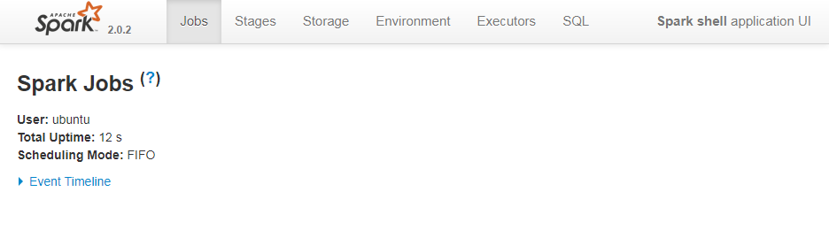

# Running a Spark cluster in stand-alone mode
In [Setting up a Hadoop cluster](./hadoop-cluster-setup.md) a description on how to set up a Hadoop cluster was provided. It is made of a master node (hosting an HDFS *NameNode* and a HDFS "DataNode") and two slaves (running an HDFS *DataNode* each). Here, a description on e how to deploy a Spark cluster in stand-alone mode on top of it is provided. As YARN is not used, no dependencies between the Hadoop and the Spark clusters will exist and Hadoop will simply provide storage capabilities. The official documentation can be accessed [here](https://spark.apache.org/docs/latest/spark-standalone.html).

* [Pre-requisites](#Pre-requisites)
* [Spark installation on all instances](#Spark installation on all instances)
* [Spark environment variables setup on master and slave nodes](#Spark environment variables setup on master and slave nodes)
* [Spark cluster slaves configuration](#Spark cluster slaves configuration)
* [Cluster start and stop](#Cluster start and stop)
* [Python and Jupyter Notebook installation](#Python and Jupyter Notebook installation)
* [Jupyter Notebook configuration](#Jupyter Notebook configuration)
* [Key take-aways](#Key take-aways)
* [See also](#See also)

----

## Pre-requisites
Hadoop 2.7.4 is installed and a cluster is set up as described in [Setting up a Hadoop cluster](./spark-cluster-management.md).

## Spark installation on all instances
A Spark release compatible with Hadoop 2.7.4, [Spark 2.0.2](https://spark.apache.org/releases/spark-release-2-0-2.html), is chosen (see a discussion on the version [below](#Key take-aways))

```bash
wget http://d3kbcqa49mib13.cloudfront.net/spark-2.0.2-bin-hadoop2.7.tgz
tar -zxvf spark-2.0.2-bin-hadoop2.7.tgz
sudo mv spark-2.0.2-bin-hadoop2.7 /usr/local/spark
rm spark-2.0.2-bin-hadoop2.7.tgz
```

## Spark environment variables setup on master and slave nodes
The following environment variables are set in the `.bashrc` file under `/home/ubuntu` (both on master and slave nodes):
```bash
echo '
# Set SPARK_HOME
export SPARK_HOME=/usr/local/spark
# Set SPARK_CONF_DIR
export SPARK_CONF_DIR=$SPARK_HOME/conf
# Add Spark bin directory to PATH
export PATH=$PATH:$SPARK_HOME/bin
' >> ~/.bashrc
```

The `.bashrc` file is reloaded:
```bash
source ~/.bashrc
```

Next, some variables in the `spark-env.sh` configuration file are activated and set on master and slave nodes:
```bash
cp $SPARK_CONF_DIR/spark-env.sh.template $SPARK_CONF_DIR/spark-env.sh
echo '
export JAVA_HOME=$(readlink -f /usr/bin/java | sed "s:bin/java::")
' >> $SPARK_CONF_DIR/spark-env.sh
```

Finally, a not so verbose logging level is configured:
```bash
cp $SPARK_CONF_DIR/log4j.properties.template $SPARK_CONF_DIR/log4j.properties
sed -i 's/log4j.rootCategory=INFO, console/log4j.rootCategory=WARN, console/' $SPARK_CONF_DIR/log4j.properties
```

It is possible to determine whether the installation has been right by running the `spark-shell` command. Besides some warnings, the output should be something like this (to exit the Spark shell, type CTRL-D):
```bash
Spark context Web UI available at http://<master-ip-address>:4040
Spark context available as 'sc' (master = local[*], app id = local-1503914008988).
Spark session available as 'spark'.
Welcome to
      ____              __
     / __/__  ___ _____/ /__
    _\ \/ _ \/ _ \`/ __/  '_/
   /___/ .__/\_,_/_/ /_/\_\   version 2.0.2
      /_/

Using Scala version 2.11.8 (Java HotSpot(TM) 64-Bit Server VM, Java 1.8.0_144)
Type in expressions to have them evaluated.
Type :help for more information.
```
If you try to run `pyspark`, an error will be raised  (sort of "Python not found" error), as python has not been installed yet.

Before leaving the shell, it is possible to verify the status of the Spark context created by running the shell in `http://<master-floating-ip-address>:4040/`:


## Spark cluster slaves configuration
The Spark `slaves` file must be created, only on the master node. Notice it has the same contents as the Hadoop `slaves` file.
```bash
echo "cluster-master
cluster-slave-1
cluster-slave-2
" > $SPARK_CONF_DIR/slaves
```

## Cluster start and stop
In the master:
```bash
$SPARK_HOME/sbin/start-master.sh
$SPARK_HOME/sbin/start-slaves.sh 
``` 
Instead, it is possible start *Master* and *Workers* at the same time:
```bash
$SPARK_HOME/sbin/start-all.sh 
``` 

To validate the cluster has been successfully started, `jps` can be run on the master and slave instances. The output should list `Worker` and` Master` on the master node:
```bash
11512 Worker
10920 Master
11677 Jps
```

And a `Worker` process in each slave instance.

The status of the Spark cluster can be verified in `http://<master-floating-ip-address>:8080/`:


Three different Workers must appear, each of them in the private IP address assigned to each instance (the Spark context UI is not available). No applications (running or completed) are listed and no Spark context UI is available.

To terminate the cluster, you can stop *Master* and *Workers* separately or just with a single command:
```bash
$SPARK_HOME/sbin/stop-master.sh
$SPARK_HOME/sbin/stop-slaves.sh 
``` 
Or:
```bash
$SPARK_HOME/sbin/stop-all.sh 
``` 

When the cluster is stopped, the Spark Cluster UI becomes unreachable.

Next, it is possible to verify whether `spark-shell` run against the cluster. First, the cluster is started again (both master and slaves). Next, the `spark-shell` is run with the `master` argument set to the IP address of the Standalone cluster:
```bash
spark-shell --master spark://<master-ip-address>:7077
```
Besides some warnings, the output should is something such as this:

```bash
Spark context Web UI available at http://<master-ip-address>:4040
Spark context available as 'sc' (master = spark://<master-ip-address>:7077, app id = app-20170828131641-0000).
Spark session available as 'spark'.
Welcome to
      ____              __
     / __/__  ___ _____/ /__
    _\ \/ _ \/ _ \`/ __/  '_/
   /___/ .__/\_,_/_/ /_/\_\   version 2.0.2
      /_/

Using Scala version 2.11.8 (Java HotSpot(TM) 64-Bit Server VM, Java 1.8.0_144)
Type in expressions to have them evaluated.
Type :help for more information.
```

If we verify the status of the Spark cluster (in `http://<master-floating-ip-address>:8080/`):


We find the existing *Workers* listed in the previous screenshot **and** the Spark shell as a new *Running Application*. At the same time, the Spark context UI (`http://<master-floating-ip-address>:4040/`) is available as well.

## Python and Jupyter Notebook installation
An Anaconda Python distribution is installed on master and slave instances. It installs not only Python 2.7 but a number of valuable Python packages and Jupyter Notebook as well:

```bash
wget https://repo.continuum.io/archive/Anaconda2-4.2.0-Linux-x86_64.sh
sudo /bin/bash Anaconda2-4.2.0-Linux-x86_64.sh -b -p /usr/local/anaconda
sudo chown -R ubuntu:ubuntu /usr/local/anaconda/
rm Anaconda2-4.2.0-Linux-x86_64.sh
/usr/local/anaconda/bin/conda update -y conda
```
Additionall, `[findspark](https://github.com/minrk/findspark)` is installed and a configuration file for Jupyter Notebook is created.

```bash
/usr/local/anaconda/bin/conda install -c conda-forge findspark -y
/usr/local/anaconda/bin/jupyter notebook --generate-config -y
```

Next, the following environment variables must be set in the `.bashrc` file under `/home/ubuntu` (both on master and slave nodes):
```bash
echo '
# Set ANACONDA_HOME
export ANACONDA_HOME=/usr/local/anaconda
# Add Anaconda bin directory to PATH
export PATH=$PATH:$ANACONDA_HOME/bin
' >> ~/.bashrc
```

The `.bashrc` file is reloaded:
```bash
source ~/.bashrc
```

Verification of that Python 2.7 proper installation can be done by typing `python`. The output should be similar to this:
```bash
Python 2.7.12 |Anaconda custom (64-bit)| (default, Jul  2 2016, 17:42:40)
[GCC 4.4.7 20120313 (Red Hat 4.4.7-1)] on linux2
Type "help", "copyright", "credits" or "license" for more information.
Anaconda is brought to you by Continuum Analytics.
Please check out: http://continuum.io/thanks and https://anaconda.org
>>>
```

Next, verification of `pyspark` availability is carried out. The output should be similar to this:
```bash
Welcome to
      ____              __
     / __/__  ___ _____/ /__
    _\ \/ _ \/ _ \`/ __/  '_/
   /__ / .__/\_,_/_/ /_/\_\   version 2.0.2
      /_/

Using Python version 2.7.12 (default, Jul  2 2016 17:42:40)
SparkSession available as 'spark'.
```

Finally we do a similar verification but this time against the Spark Standalone cluster:
```bash
pyspark --master spark://<master-floating-ip-address>:7077
```

## Jupyter Notebook configuration
The default Jupyter Notebook configuration must be updated in order to determine where the code must be loaded from and to enable access to the notebook server. Thus, a folder for notebooks and kernels must be created:
```bash
mkdir ~/notebooks
```

Next, the Jupyter Notebook configuration file, `~/.jupyter/jupyter_notebook_config.py`, must be updated to use the just created folder and for enable the access from external IP addresses to the notebooks:
```bash
sed -i "s/#c.NotebookApp.notebook_dir = u''/c.NotebookApp.notebook_dir = u'\/home\/ubuntu\/notebooks'/" ~/.jupyter/jupyter_notebook_config.py
sed -i "s/#c.NotebookApp.ip = 'localhost'/c.NotebookApp.ip = '*'/" ~/.jupyter/jupyter_notebook_config.py
```

Finally, Spark must be configured 

```bash
pyspark --master spark://<master-ip-address>:7077
```

## Key take-aways
* Installation and deployment of Spark is supposed to be a simple and straightforward. Downloading, unpacking and minimal configuration would be enough for starting to work (tuning is absolutely necessary, but even with default options Spark should offer the standard functionality). However, a version downgrade from the version initially used ([Spark 2.1.1](https://spark.apache.org/releases/spark-release-2-1-1.html)) has been necessary as, once Spark was installed, when running `spartk-shell`, the following error popped up:
```bash
java.lang.IllegalArgumentException: Error while instantiating 'org.apache.spark.sql.hive.HiveSessionState'
```
    - The same behavior was observed with Spark 2.2.0, so that finally, we fell back to Spark 2.0.2.
* If an error related to the lack of entrophy is raised when running `spark-shell` or `pyspark` (`https://www.howtoforge.com/helping-the-random-number-generator-to-gain-enough-entropy-with-rng-tools-debian-lenny`), a better generator has to be installed (`[rng-tools](https://www.howtoforge.com/helping-the-random-number-generator-to-gain-enough-entropy-with-rng-tools-debian-lenny)`)

## See also
* [Running Spark on a YARN cluster](./spark-yarn-cluster-setup.md)
* [Running Spark on a standalone cluster](./spark-standalone-cluster-setup.md)