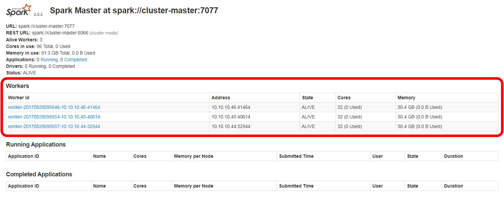
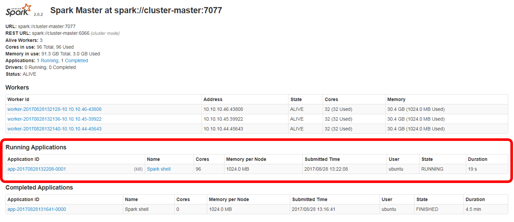

# Running a Spark cluster in Standalone mode on an HDFS cluster
In [Setting up an HDFS cluster](./hadoop-cluster-setup.md) a description on how to set up an HDFS cluster was provided. It is made of a master node (hosting an HDFS *NameNode*) and three slaves (running an HDFS *DataNode* each). Here, a description on how to deploy a Spark cluster in Standalone mode on top of it is provided. As YARN is not used, no dependencies between the HDFS and the Spark clusters will exist and HDFS will simply provide storage capabilities. The official documentation can be accessed [here](https://spark.apache.org/docs/latest/spark-standalone.html).

* [Pre-requisites](#pre-requisites)
* [Spark installation on all instances](#spark-installation-on-all-instances)
* [Spark environment variables setup on master and slave nodes](#spark-environment-variables-setup-on-master-and-slave-nodes)
* [Additional Spark configuration](#additional-spark-configuration)
* [Spark cluster slaves configuration](#spark-cluster-slaves-configuration)
* [Cluster start and stop](#cluster-start-and-stop)
* [Key take-aways](#key-take-aways)
* [See also](#see-also)

----

## Pre-requisites
Hadoop 2.7.4 is installed and a cluster is set up as described in [Setting up an HDFS cluster](./spark-cluster-management.md). If no HDSF support is needed, it is possible just to [install Java](./java-setup.md) in all the cluster instances and skip the HDFS installation.

## Spark installation on all instances
A Spark release compatible with Hadoop 2.7.4 and Zeppelin 0.7.2, [Spark 2.0.2](https://spark.apache.org/releases/spark-release-2-0-2.html), is chosen (see a discussion on the version [below](#key-take-aways)). Use a symbolic link to easily upgrade or change versions if wished.

```bash
wget http://d3kbcqa49mib13.cloudfront.net/spark-2.0.2-bin-hadoop2.7.tgz
tar -zxvf spark-2.0.2-bin-hadoop2.7.tgz
sudo mkdir -p /opt/sparks
sudo mv spark-2.0.2-bin-hadoop2.7 /opt/sparks
sudo ln -s /opt/sparks/spark-2.0.2-bin-hadoop2.7 /usr/local/spark
rm spark-2.0.2-bin-hadoop2.7.tgz
```

## Spark environment variables setup on master and slave nodes
The following environment variables are set in the `.bashrc` file under `/home/ubuntu` (both on master and slave nodes):
```bash
echo '
# Set SPARK_HOME
export SPARK_HOME=/usr/local/spark
# Set SPARK_CONF_DIR
export SPARK_CONF_DIR=$SPARK_HOME/conf
# Add Spark bin and sbin directories to PATH
export PATH=$PATH:$SPARK_HOME/sbin:$SPARK_HOME/bin
' >> ~/.bashrc
```

The `.bashrc` file is reloaded:
```bash
source ~/.bashrc
```

## Additional Spark configuration
Next, some additional variables in the `spark-env.sh` configuration file are activated and set on master and slave nodes:
```bash
cp $SPARK_CONF_DIR/spark-env.sh.template $SPARK_CONF_DIR/spark-env.sh
echo '
export JAVA_HOME=$(readlink -f /usr/bin/java | sed "s:bin/java::")
' >> $SPARK_CONF_DIR/spark-env.sh
```

Some desirable configuration options are those related to logging. Suggestion from *Spark in action* (chapter 2) for `log4j.properties` follows. Update the logging configuration file on master and slaves:
```bash
echo "# set global logging severity to INFO (and upwards: WARN, ERROR, FATAL)
log4j.rootCategory=INFO, console, file

# console config (restrict only to ERROR and FATAL)
log4j.appender.console=org.apache.log4j.ConsoleAppender
log4j.appender.console.target=System.err
log4j.appender.console.threshold=ERROR
log4j.appender.console.layout=org.apache.log4j.PatternLayout
log4j.appender.console.layout.ConversionPattern=%d{yy/MM/dd HH:mm:ss} %p %c{1}: %m%n

# file config
log4j.appender.file=org.apache.log4j.RollingFileAppender
log4j.appender.file.File=$SPARK_HOME/logs/info.log
log4j.appender.file.MaxFileSize=5MB
log4j.appender.file.MaxBackupIndex=10
log4j.appender.file.layout=org.apache.log4j.PatternLayout
log4j.appender.file.layout.ConversionPattern=%d{yy/MM/dd HH:mm:ss} %p %c{1}: %m%n

# Settings to quiet third party logs that are too verbose
log4j.logger.org.eclipse.jetty=WARN
log4j.logger.org.eclipse.jetty.util.component.AbstractLifeCycle=ERROR
log4j.logger.org.apache.spark.repl.SparkIMain$exprTyper=INFO
log4j.logger.org.apache.spark.repl.SparkILoop$SparkILoopInterpreter=INFO
log4j.logger.org.apache.spark=WARN
log4j.logger.org.apache.hadoop=WARN
" > $SPARK_CONF_DIR/log4j.properties
```
That way, only `spark-shell` errors will be printed in console. The complete log is however available in `$SPARK_HOME/logs/info.log`.

From release 2.1.0 onwards, the Spark binaries have been created with built-in Hive support (if not planning to use it, Spark sources can be downloaded and rebuilt with Maven omitting the options `-Phive -Phive-thriftserver`, see [this answer in StackOverflow](https://stackoverflow.com/a/41638505/7618228)). Thus, it always created a `derby.log` file and a `metastore_db` folder in the current directory. The best way to reduce the burden related to Hive is to make them be created in a specific default folder, on the master node ([reference](https://stackoverflow.com/a/44048667/7618228)):
```bash
mkdir -p /tmp/derby
chmod 777 /tmp/derby
cp $SPARK_CONF_DIR/spark-defaults.conf.template $SPARK_CONF_DIR/spark-defaults.conf
echo "
spark.driver.extraJavaOptions -Dderby.system.home=/tmp/derby
" >> $SPARK_CONF_DIR/spark-defaults.conf
```

It is possible to determine whether the installation has been right by running the `spark-shell` command in any instance (`spark-shell` without arguments is equivalent to `spark-shell --master local[*]`). Besides some warnings, the output should be something like this (to exit the Spark shell, type CTRL-D) when run on the master instance:
```bash
Spark context Web UI available at http://<master-ip-address>:4040
Spark context available as 'sc' (master = local[*], app id = local-1503914008988).
Spark session available as 'spark'.
Welcome to
      ____              __
     / __/__  ___ _____/ /__
    _\ \/ _ \/ _ \`/ __/  '_/
   /___/ .__/\_,_/_/ /_/\_\   version 2.0.2
      /_/

Using Scala version 2.11.8 (Java HotSpot(TM) 64-Bit Server VM, Java 1.8.0_144)
Type in expressions to have them evaluated.
Type :help for more information.
```
If you try to run `pyspark`, an error will be raised  (sort of "Python not found" error), as python has not been installed yet.

Before leaving the shell, it is possible to verify the status of the Spark context created by running the shell in `http://<master-floating-ip-address>:4040/`:


It is important to note that from release 2.1.0 onwards, if the environment variable `$HADOOP_CONF_DIR` is set, the execution of `spark-shell` will throw an error (`java.lang.IllegalArgumentException: Error while instantiating 'org.apache.spark.sql.hive.HiveSessionStateBuilder'`). In testing situations with no HDSF cluster started, `$HADOOP_CONF_DIR` should be unset:
```bash
unset HADOOP_CONF_DIR
```

## Spark cluster slaves configuration
The Spark `slaves` file must be created, only on the master node.
```bash
echo "cluster-master
cluster-slave-1
cluster-slave-2
cluster-slave-3
" > $SPARK_CONF_DIR/slaves
```

## Cluster start and stop
In the master:
```bash
$SPARK_HOME/sbin/start-master.sh
$SPARK_HOME/sbin/start-slaves.sh 
``` 
Instead, it is possible start *Master* and *Workers* at the same time:
```bash
$SPARK_HOME/sbin/start-all.sh 
``` 

To validate the cluster has been successfully started, the JVM Process Status tool can be run on the master and slave instances. The output should list `Worker` and `Master` on the master node:
```bash
11512 Worker
10920 Master
11677 Jps
```

And a `Worker` process in each slave instance.

The status of the Spark cluster can be verified in `http://<master-floating-ip-address>:8080/`:



Three different Workers must appear, each of them in the private IP address assigned to each instance (the Spark context UI is not available). No applications (running or completed) are listed and no Spark context UI is available.

To terminate the cluster, you can stop *Master* and *Workers* separately or just with a single command:
```bash
$SPARK_HOME/sbin/stop-master.sh
$SPARK_HOME/sbin/stop-slaves.sh 
``` 
Or:
```bash
$SPARK_HOME/sbin/stop-all.sh 
``` 

When the cluster is stopped, the Spark Cluster UI becomes unreachable.

Next, it is possible to verify whether `spark-shell` run against the cluster. First, the cluster is started again (both master and slaves). Next, the `spark-shell` is run with the `master` argument set to the IP address of the Spark Standalone cluster:
```bash
spark-shell --master spark://<master-ip-address>:7077
```
Besides some warnings, the output should is something such as this:

```bash
Spark context Web UI available at http://<master-ip-address>:4040
Spark context available as 'sc' (master = spark://<master-ip-address>:7077, app id = app-20170828131641-0000).
Spark session available as 'spark'.
Welcome to
      ____              __
     / __/__  ___ _____/ /__
    _\ \/ _ \/ _ \`/ __/  '_/
   /___/ .__/\_,_/_/ /_/\_\   version 2.0.2
      /_/

Using Scala version 2.11.8 (Java HotSpot(TM) 64-Bit Server VM, Java 1.8.0_144)
Type in expressions to have them evaluated.
Type :help for more information.
```

If we verify the status of the Spark cluster (in `http://<master-floating-ip-address>:8080/`):



We find the existing *Workers* listed in the previous screenshot **and** the Spark shell as a new *Running Application*. At the same time, the Spark context UI (`http://<master-floating-ip-address>:4040/`) is available as well.

## Key take-aways
Installation and deployment of Spark is supposed to be simple and straightforward. Downloading, unpacking and minimal configuration would be enough for starting to work (tuning is absolutely necessary, but even with default options, Spark should offer the standard functionality). However, some issues may aries:
* Interaction between Spark and other Hadoop technologies must be carefully planned. In particular, Spark releases from 2.1.0 onwards come with activated Hive support and that can create specific problems when interacting with Hadoop if the HSFS cluster is configured but not started. In said situations, when running `spark-shell`, the following error pops up: `java.lang.IllegalArgumentException: Error while instantiating 'org.apache.spark.sql.hive.HiveSessionState'`. Starting the cluster or unsetting the environment variable `$HADOOP_CONF_DIR` would be enough.
* Zeppelin 0.7.2 does not support Spark releases from 2.2.0 onwards.
* As mentioned, the default Hive configuration leads to the creation of a `derby.log` file and a `metastore_db` folder in the location where the shell is run. As mentioned above, a suitable location have to be configured.

## See also
* [Infrastructure deployment index](./infrastructure.md)
* [Running Jupyter notebooks on a Spark Standalone cluster](./jupyter-setup.md)
* [Running Zeppelin notebooks on a Spark Standalone cluster](./zeppelin-setup.md)
* [Saving data from Spark to Elasticsearch indices](./spark-elasticsearch-setup.md)